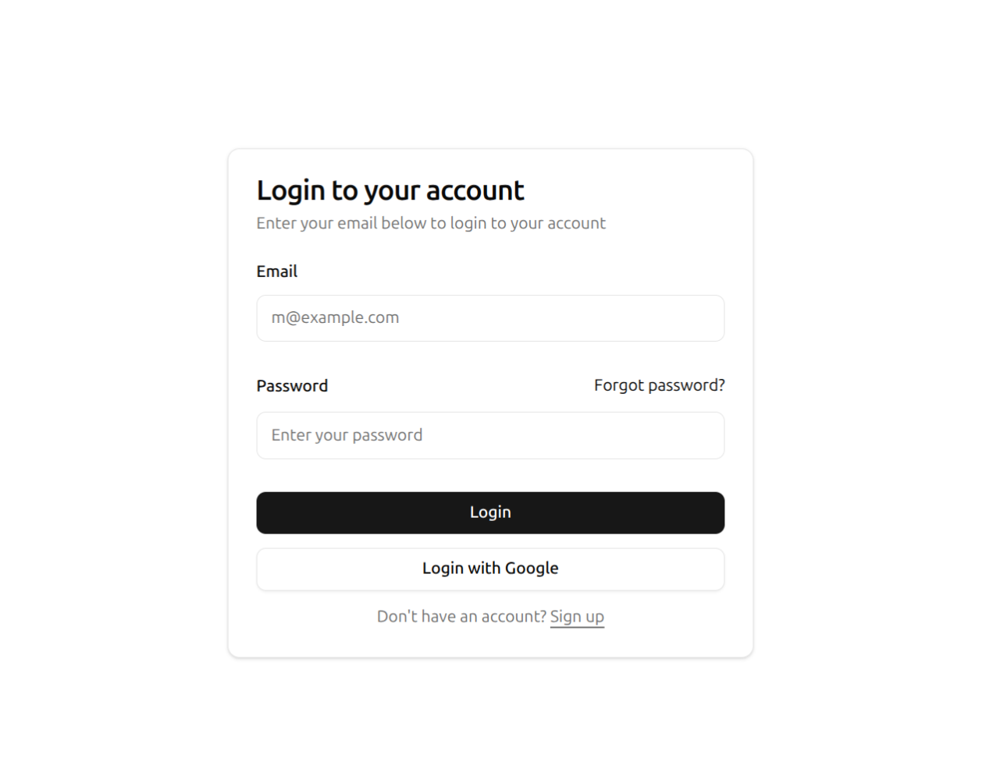
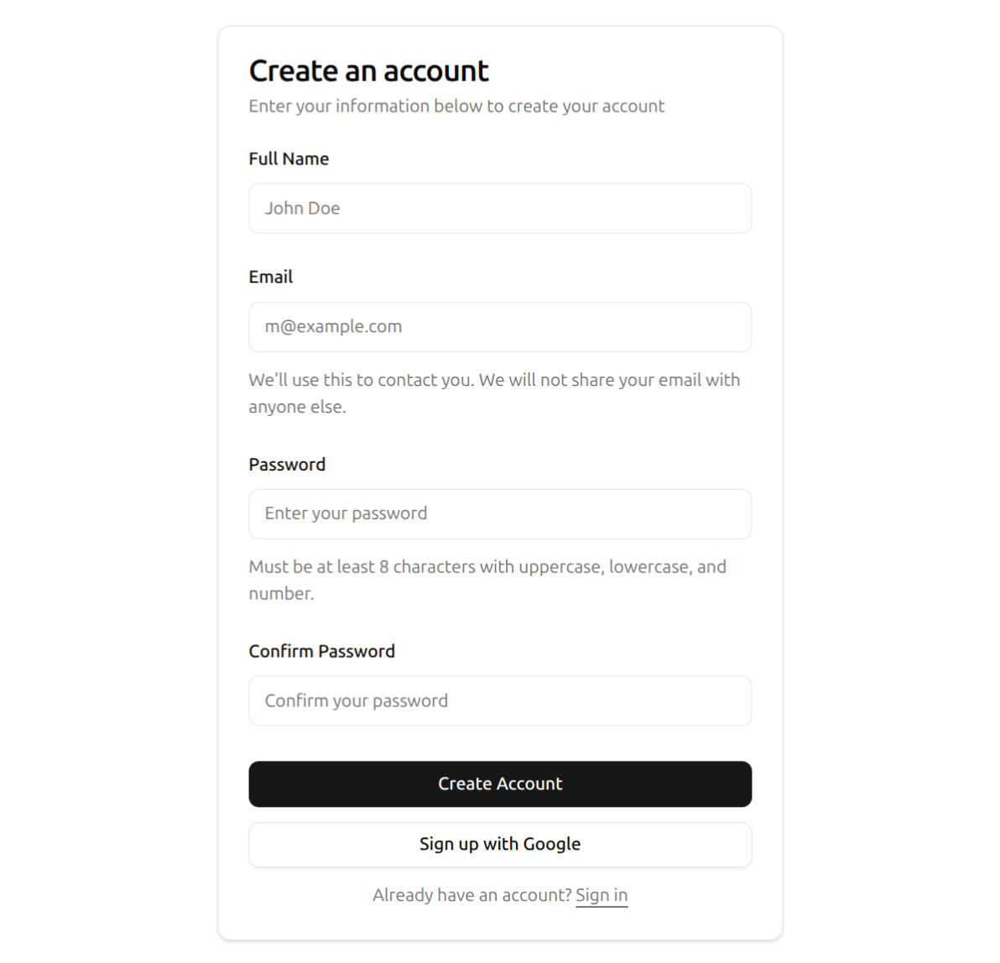
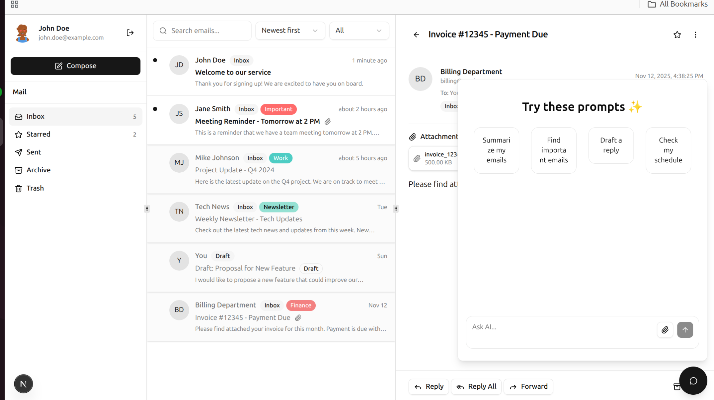

# Email AI - Advanced Email Frontend

**G03 - React Authentication (Email+Password + Google Sign-In) + Email Dashboard Mockup**

📺 [Video Tutorial](https://www.youtube.com/watch?v=1_uFQTqI6d4)

A modern, feature-rich email management application built with Next.js, React, and TypeScript. This application provides an intuitive interface for managing emails with AI-powered features.

## 📸 Screenshots

### Login Page



### Sign Up Page



### Mail Inbox


### AI Chatbox



## ✨ Features

- 🔐 **Authentication System**
  - User registration and login
  - OTP verification
  - Google OAuth integration
  - JWT token management with automatic refresh
  - Protected routes with client-side guards

- 📧 **Email Management**
  - View emails by folder (Inbox, Sent, Drafts, etc.)
  - Email detail view
  - Mark as read/unread
  - Star/unstar emails
  - Bulk actions
  - Email filtering and search

- 🤖 **AI-Powered Features**
  - AI chatbox for email assistance
  - Smart email suggestions
  - Automated email responses

- 🎨 **Modern UI/UX**
  - Responsive design
  - Dark mode support
  - Smooth animations with Framer Motion
  - Accessible components with Radix UI
  - Tailwind CSS styling

## 🛠️ Tech Stack

- **Framework**: Next.js 16 (App Router)
- **Language**: TypeScript
- **UI Library**: React 19
- **Styling**: Tailwind CSS 4
- **UI Components**: Radix UI, Shadcn UI
- **State Management**: Zustand
- **Data Fetching**: TanStack Query (React Query)
- **Forms**: React Hook Form + Zod
- **HTTP Client**: Axios
- **Animations**: Framer Motion
- **Icons**: Lucide React

## 📋 Prerequisites

Before you begin, ensure you have the following installed:

- **Node.js** 18.x or higher
- **npm** 9.x or higher (or **yarn** / **pnpm** / **bun**)

You can check your versions by running:

```bash
node --version
npm --version
```

## 🚀 First-Time Setup

### 1. Clone the Repository

```bash
git clone <repository-url>
cd web-advance-email-frontend
```

### 2. Install Dependencies

```bash
npm install
```

Or if you prefer other package managers:

```bash
# Using yarn
yarn install

# Using pnpm
pnpm install

# Using bun
bun install
```

### 3. Environment Variables

Create a `.env.local` file in the root directory:

```bash
cp .env.example .env.local
```

Or create `.env.local` manually with the following variables:

```env
# API Configuration
NEXT_PUBLIC_API_BASE_URL=http://localhost:8000/api
NEXT_PUBLIC_INTERNAL_API_BASE_URL=http://localhost:8000/api/internal

# Google OAuth Configuration (if using Google Sign-In)
NEXT_PUBLIC_GOOGLE_CLIENT_ID=your-google-client-id-here

# Optional: Add other environment variables as needed
```

**Note**:

- Replace the API URLs with your actual backend API endpoints
- For Google OAuth, you'll need to set up a Google OAuth client ID (see Third-Party Services section)

### 4. Run the Development Server

```bash
npm run dev
```

The application will be available at [http://localhost:3000](http://localhost:3000)

Open your browser and navigate to the URL to see the application.

### 5. Verify Installation

After starting the development server, you should see:

- The application loads without errors
- You can navigate to the login page
- The development server is running on port 3000 (or your specified port)

## 📜 Available Scripts

### Development

```bash
# Start development server
npm run dev

# Start production server (after build)
npm run start
```

### Building

```bash
# Create production build
npm run build
```

### Code Quality

```bash
# Run ESLint
npm run lint

# Fix ESLint errors automatically
npm run lint:fix

# Type check without emitting files
npm run type-check

# Run both type check and lint
npm run validate
```

## 📁 Project Structure

```
web-advance-email-frontend/
├── app/                    # Next.js App Router pages
│   ├── (auth)/            # Authentication routes
│   │   ├── login/
│   │   ├── signup/
│   │   └── verify-otp/
│   ├── (routes)/          # Protected routes
│   │   └── mail/          # Email management pages
│   └── layout.tsx         # Root layout
├── components/            # React components
│   ├── authentication/    # Auth-related components
│   ├── email/             # Email-related components
│   ├── chat/              # AI chat components
│   └── ui/                # Reusable UI components
├── hooks/                 # Custom React hooks
├── lib/                   # Library code
│   ├── stores/           # Zustand stores
│   └── utils.ts          # Utility functions
├── services/              # API services
│   ├── axios.bi.ts       # Axios instance with interceptors
│   ├── auth.service.ts   # Authentication service
│   └── email.service.ts  # Email service
├── types/                 # TypeScript type definitions
├── utils/                 # Utility functions
│   ├── constants/        # App constants
│   └── helpers/          # Helper functions
├── providers/             # React context providers
├── public/                # Static assets
└── middleware.ts          # Next.js middleware (currently disabled)
```

## 🌐 Public Hosting & Deployment

### Public URL

**Production URL**: [https://your-app.vercel.app](https://your-app.vercel.app) _(Update with your actual deployment URL)_

### Deploying to Production

This application is optimized for deployment on **Vercel** (recommended) or any platform that supports Next.js.

#### Option 1: Deploy to Vercel (Recommended)

1. **Push your code to GitHub/GitLab/Bitbucket**

2. **Import project to Vercel**:
   - Go to [vercel.com](https://vercel.com)
   - Click "New Project"
   - Import your repository
   - Vercel will auto-detect Next.js settings

3. **Configure Environment Variables**:
   - In Vercel project settings, add all environment variables from `.env.local`:
     - `NEXT_PUBLIC_API_BASE_URL`
     - `NEXT_PUBLIC_INTERNAL_API_BASE_URL`
     - `NEXT_PUBLIC_GOOGLE_CLIENT_ID` (if using Google OAuth)
   - Set production API URLs (not localhost)

4. **Deploy**:
   - Vercel will automatically deploy on every push to main branch
   - Or click "Deploy" to deploy immediately

5. **Verify Deployment**:
   - Visit your Vercel deployment URL
   - Test authentication and API connections

#### Option 2: Deploy Locally (Production Build)

To test a production build locally:

```bash
# Build the application
npm run build

# Start production server
npm run start
```

The production server will run on [http://localhost:3000](http://localhost:3000)

**Note**: Make sure to set production environment variables before building.

#### Option 3: Deploy to Other Platforms

For other hosting providers (Netlify, AWS, DigitalOcean, etc.):

1. Build the application: `npm run build`
2. Set environment variables in your hosting platform
3. Configure the platform to run `npm run start`
4. Ensure Node.js 18+ is available

### Environment Variables for Production

When deploying, ensure these environment variables are set in your hosting platform:

```env
NEXT_PUBLIC_API_BASE_URL=https://your-api-domain.com/api
NEXT_PUBLIC_INTERNAL_API_BASE_URL=https://your-api-domain.com/api/internal
NEXT_PUBLIC_GOOGLE_CLIENT_ID=your-production-google-client-id
```

## 🔐 Token Storage & Security Considerations

### Token Storage Implementation

This application stores JWT tokens in **browser cookies** (not localStorage or sessionStorage) for the following reasons:

#### Current Implementation

- **Storage Method**: Browser cookies (client-side accessible)
- **Access Token**: Stored in `access_token` cookie (7 days expiry)
- **Refresh Token**: Stored in `refresh_token` cookie (30 days expiry)
- **Cookie Settings**:
  - `secure`: Enabled in production (HTTPS only)
  - `sameSite`: `lax` (CSRF protection)
  - `path`: `/` (available site-wide)

#### Security Features

1. **Secure Flag**: Cookies are only sent over HTTPS in production
2. **SameSite Protection**: Prevents CSRF attacks by restricting cross-site requests
3. **Automatic Token Refresh**: Access tokens are automatically refreshed when expired
4. **Token Validation**: Tokens are validated on the client-side before use
5. **Automatic Cleanup**: Tokens are removed on logout

#### Security Considerations

**Current Approach (Client-Side Cookies)**:

- ✅ Tokens are accessible to JavaScript (needed for client-side token management)
- ✅ Automatic token refresh works seamlessly
- ✅ Works with client-side routing
- ⚠️ Tokens are accessible via `document.cookie` (XSS risk if not properly sanitized)
- ⚠️ Not HTTP-only (can be accessed by JavaScript)

**Alternative Approach (HTTP-Only Cookies)**:
For enhanced security, consider migrating to HTTP-only cookies:

- ✅ Not accessible to JavaScript (XSS protection)
- ✅ Automatically sent with requests
- ⚠️ Requires server-side token management
- ⚠️ More complex refresh token flow
- ⚠️ Requires API endpoints to set cookies

#### Recommendations

1. **XSS Protection**:
   - Always sanitize user input
   - Use Content Security Policy (CSP) headers
   - Avoid `dangerouslySetInnerHTML` with user content

2. **HTTPS Only**:
   - Always use HTTPS in production
   - The `secure` flag ensures cookies only work over HTTPS

3. **Token Expiry**:
   - Access tokens expire after 7 days
   - Refresh tokens expire after 30 days
   - Consider shorter expiry times for sensitive applications

4. **Future Improvements**:
   - Consider migrating to HTTP-only cookies for production
   - Implement token rotation for refresh tokens
   - Add token revocation mechanism

### Code Location

Token storage implementation can be found in:

- `services/jwt.ts` - Token management functions
- `utils/helpers/cookie.ts` - Cookie utility functions
- `services/axios.bi.ts` - Token refresh interceptor

## 🔐 Authentication Flow

1. **Registration/Login**: Users can sign up or log in with email/password or Google OAuth
2. **OTP Verification**: New users must verify their email with OTP
3. **Token Management**: JWT tokens are stored in browser cookies with security flags
4. **Auto Refresh**: Access tokens are automatically refreshed when expired
5. **Route Protection**: Client-side route guards protect authenticated routes

## 🎯 Key Features Implementation

### Route Protection

The application uses `useAuthGuard` hook for client-side route protection:

- Automatically redirects unauthenticated users to login
- Redirects authenticated users away from auth pages
- Watches for real-time auth state changes (token expiration, logout)

### State Management

- **Zustand**: Global state management for authentication and email data
- **React Query**: Server state management and caching for API calls

### API Integration

- Axios interceptors handle:
  - Automatic token attachment to requests
  - Token refresh on 401 errors
  - Request queuing during token refresh

## 🐛 Troubleshooting

### Port Already in Use

If port 3000 is already in use, you can specify a different port:

```bash
npm run dev -- -p 3001
```

### Environment Variables Not Loading

Make sure your `.env.local` file is in the root directory and restart the development server.

### Build Errors

If you encounter build errors:

1. Clear the `.next` folder: `rm -rf .next`
2. Clear node_modules: `rm -rf node_modules`
3. Reinstall dependencies: `npm install`
4. Rebuild: `npm run build`

## 🔌 Third-Party Services

This application integrates with the following third-party services:

### 1. Google OAuth (Authentication)

**Purpose**: Allow users to sign in with their Google account

**Setup Instructions**:

1. **Create Google OAuth Credentials**:
   - Go to [Google Cloud Console](https://console.cloud.google.com/)
   - Create a new project or select an existing one
   - Enable "Google+ API" or "Google Identity Services"
   - Go to "Credentials" → "Create Credentials" → "OAuth client ID"
   - Choose "Web application"
   - Add authorized JavaScript origins:
     - `http://localhost:3000` (for development)
     - `https://your-production-domain.com` (for production)
   - Add authorized redirect URIs:
     - `http://localhost:3000/api/auth/google/callback` (for development)
     - `https://your-production-domain.com/api/auth/google/callback` (for production)

2. **Get Client ID**:
   - Copy the Client ID from Google Cloud Console
   - Add it to your `.env.local` file:
     ```env
     NEXT_PUBLIC_GOOGLE_CLIENT_ID=your-client-id-here
     ```

3. **Backend Configuration**:
   - Ensure your backend API handles Google OAuth callback
   - Backend should exchange the authorization code for tokens
   - Backend should return JWT tokens in the same format as email/password login

**Current Status**:

- Google OAuth service methods are implemented in `services/auth.service.ts`
- UI components have placeholder buttons for Google sign-in
- Full OAuth flow integration is pending backend implementation

**Documentation**:

- [Google OAuth 2.0 Documentation](https://developers.google.com/identity/protocols/oauth2)
- [Google Identity Services](https://developers.google.com/identity/gsi/web)

### 2. Hosting Provider (Vercel - Recommended)

**Purpose**: Host and deploy the Next.js application

**Why Vercel**:

- Built by the creators of Next.js
- Zero-configuration deployment
- Automatic HTTPS
- Global CDN
- Serverless functions support
- Environment variables management
- Automatic deployments from Git

**Alternative Hosting Options**:

- **Netlify**: Similar to Vercel, good Next.js support
- **AWS Amplify**: AWS-based hosting with CI/CD
- **DigitalOcean App Platform**: Simple PaaS solution
- **Self-hosted**: Docker container on any VPS

**Vercel Setup**:

1. Sign up at [vercel.com](https://vercel.com)
2. Connect your Git repository
3. Configure environment variables
4. Deploy automatically on every push

**Documentation**:

- [Vercel Documentation](https://vercel.com/docs)
- [Next.js Deployment Guide](https://nextjs.org/docs/deployment)

### 3. Backend API

**Purpose**: Provides authentication, email management, and AI features

**Configuration**:

- Set `NEXT_PUBLIC_API_BASE_URL` to your backend API URL
- Backend should support CORS for your frontend domain
- Backend should handle JWT token validation
- Backend should provide refresh token endpoint

**API Endpoints Used**:

- `/api/auth/login` - User login
- `/api/auth/signup` - User registration
- `/api/auth/google` - Google OAuth
- `/api/auth/refresh` - Token refresh
- `/api/auth/logout` - User logout
- `/api/auth/me` - Get current user
- `/api/mailboxes` - Get mailboxes
- `/api/emails` - Email operations

### Service Dependencies Summary

| Service        | Purpose               | Required    | Status      |
| -------------- | --------------------- | ----------- | ----------- |
| Backend API    | Authentication & Data | ✅ Yes      | Required    |
| Google OAuth   | Social Login          | ⚠️ Optional | Pending     |
| Vercel/Hosting | Deployment            | ✅ Yes      | Recommended |

## 📝 Code Conventions

This project follows specific code conventions:

- **Components**: PascalCase (e.g., `Button.tsx`, `FormLogin.tsx`)
- **Hooks**: camelCase starting with "use" (e.g., `useAuth.ts`, `useBoolean.ts`)
- **API Files**: camelCase (e.g., `user.ts`, `email.ts`)
- **Types**: PascalCase (e.g., `User`, `IUserLoginParams`)
- **Constants**: UPPER_SNAKE_CASE (e.g., `API_BASE_URL`)

See the project's code conventions documentation for more details.

## 🤝 Contributing

1. Create a feature branch: `git checkout -b feat/your-feature-name`
2. Make your changes
3. Run linting and type checking: `npm run validate`
4. Commit your changes: `git commit -m "feat: your feature description"`
5. Push to the branch: `git push origin feat/your-feature-name`
6. Open a Pull Request

## 📄 License

This project is private and proprietary.

## 🆘 Support

For issues or questions, please contact the development team or create an issue in the repository.

---

**Happy Coding! 🚀**
